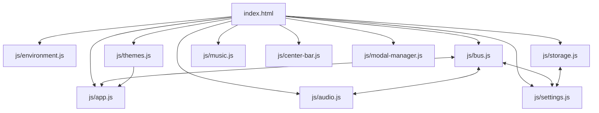
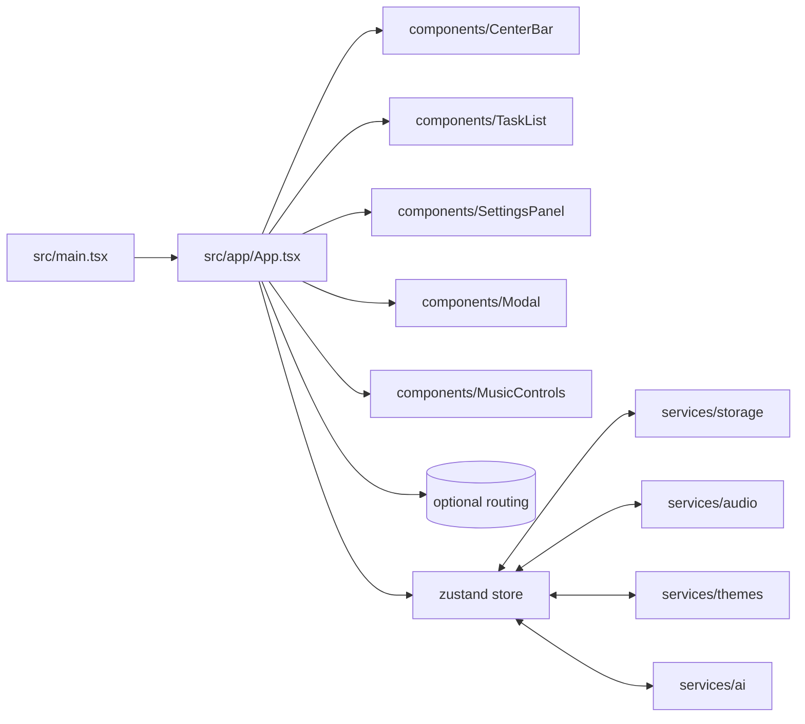

# Architecture Review & Modernization Plan

This document captures the current architecture, key pain points, CSS audit, and a step-by-step plan to migrate to a modern, maintainable React + TypeScript stack using Vite.

## Current Architecture (Summary)
- Runtime: Static site served via `serve` (npm), deployed to GitHub Pages.
- Entry: `index.html` loads many scripts with strict order; features communicate via a global event bus (`js/bus.js`).
- Code: Large vanilla JS modules in `js/` (e.g., `app.js`, `center-bar.js`, `themes.js`, `audio.js`, `settings.js`).
- Styles: `styles/main.css` aggregates large CSS files via `@import` (e.g., `components.css` ~138k). Theme tokens live in `styles/theme-system.css`.
- Data: LocalStorage through `js/storage.js`. No module bundling or type checking.

## Observed Issues (Flaws)
- Global load-order coupling: index.html script ordering is fragile; globals are widely shared.
- Large files and mixed concerns: `app.js`, `center-bar.js`, `themes.js` combine logic, DOM, and state.
- Implicit contracts: event names/payloads are untyped; refactors are risky.
- CSS monolith: `components.css` is big; specificity and cascade are hard to reason about; `@import` chains slow in production.
- Testing gap: no unit/component tests; manual QA only.
- Deployment builds raw sources; no code splitting, tree-shaking, or type checks.

## CSS Audit & Improvements
- Keep tokens: Retain `styles/theme-system.css` as the single source of truth for CSS variables (colors, spacing, typography).
- Modularize: Split `components.css` into per-component styles colocated with components (CSS Modules or BEM namespaces).
- Layers: Organize as Base (reset, tokens) → Components (scoped) → Utilities (helpers) → Overrides (rare).
- Remove `@import` at runtime: Use Vite to bundle CSS; generate a single hashed CSS file.
- Naming: Prefer component-scoped class names (e.g., `.centerBar_*`) or CSS Modules; avoid broad element selectors in components.
- Performance: Prune unused animations; prefer `transform`/`opacity`; avoid heavy box-shadows on mobile.

## Proposed Architecture (React + TS + Vite)
- Build: Vite + TypeScript + strict mode.
- UI: React 18 (function components + hooks), small components per feature.
- State: Zustand (simple, minimal boilerplate) with typed slices (tasks, settings, audio, themes).
- Services: Typed modules for `bus`, `storage`, `audio`, `ai` (fetch client), `statistics`.
- Styles: CSS Modules + existing theme variables; optional utility layer.
- Tests: Vitest + Testing Library for components and stores.
- PWA: `vite-plugin-pwa` with current `manifest.json` ported.

## Migration Plan (Phased)
1) Foundation
- Create branch `feat/react-ts-migration`. Scaffold Vite React TS. Enable strict TS, path aliases (`@/*`).
- Add ESLint + Prettier, Vitest + Testing Library, `zustand`, `vite-plugin-pwa`.

2) Type Domain & Services
- Define types: `Task`, `TaskId`, `Settings`, `ThemeId`, `AudioState`.
- Port services to TS first (no UI): `storage`, `bus` (typed events), `audio`, `themes`, `ai` client, `statistics`.

3) Skeleton UI
- Implement `App.tsx` with layout matching current DOM sections.
- Build core components: `CenterBar`, `TaskInput`, `TaskList`, `Modal`, `SettingsPanel`, `StatsDisplay`.
- Wire to Zustand store; replicate current behaviors incrementally.

4) CSS Migration
- Move `styles/theme-system.css` to `src/styles/theme-system.css` and import in `main.tsx`.
- Split `components.css` into per-component CSS Modules; keep class names close to existing semantics.
- Remove runtime `@import`; let Vite handle bundling.

5) Feature Parity
- Port remaining helpers: `quotes`, `affirmations`, `daily-summary`, `swipe-gestures`, `nebula-parallax` as hooks/services.
- Implement events as typed callbacks or `CustomEvent` wrappers where suitable.

6) Testing & Hardening
- Add tests for: task add/edit/complete, settings changes, theme switch, audio toggle, modal flows.
- Add e2e-lite with Playwright (optional later).

7) Build & Deploy
- Update GitHub Pages workflow to `npm ci && npm run build` and deploy `dist/`.
- Keep legacy app until parity; switch DNS/Pages to new build when ready.

## Concrete File Mapping (Examples)
- `js/app.js` → `src/app/App.tsx` + `src/features/tasks/*` + `src/components/*`
- `js/center-bar.js` → `src/components/CenterBar/CenterBar.tsx`
- `js/settings.js` + `js/settings-loader.js` → `src/features/settings/*`
- `js/storage.js` → `src/services/storage.ts`
- `js/bus.js` → `src/services/bus.ts` (typed events)
- `js/audio.js` + `js/music*.js` → `src/services/audio.ts` + `src/features/music/*`
- `styles/components.css` → split across component CSS Modules

## Risks & Mitigations
- Behavior drift: Backfill with component tests; migrate feature-by-feature with toggles.
- CSS regressions: Port tokens first; snapshot visual diffs for critical screens.
- Scope creep: Lock MVP parity list (tasks, filters, settings, themes, audio, modal) before extras.

## Acceptance Criteria
- Same task flows and settings behavior as current app.
- No global script-order dependencies; all imports resolved by Vite.
- Type-safe services and store; no `any` in public APIs.
- Bundled CSS with tokens intact; Lighthouse OK on mobile.

---

Appendix: Commands (Scaffold)
- npm create vite@latest web -- --template react-ts
- cd web && npm i && npm i -D eslint @typescript-eslint/parser @typescript-eslint/eslint-plugin prettier vite-plugin-pwa vitest @testing-library/react @testing-library/user-event @testing-library/dom zustand

Appendix: tsconfig essentials
- "strict": true, "baseUrl": ".", "paths": { "@/*": ["src/*"] }, "lib": ["ES2021", "DOM"]

## Near‑Term, Non‑Invasive Improvements
These changes are low risk and can be applied before or during migration.

### Code Hygiene
- Centralize constants: add `js/constants.js` for event names, storage keys, selectors; replace literals gradually.
- JSDoc + `@ts-check`: add `// @ts-check` and typedefs in `js/types.d.ts` (Task, Settings, Theme) for editor type checks.
- Guarded globals: expose a single `window.App` namespace; avoid new global leaks.
- Dead code: remove unused debug files and no‑op log stubs (e.g., in `js/ai-providers.js`).

### CSS Cleanup
- Token first: keep `styles/theme-system.css` as the single token source.
- Modularize gradually: group selectors per component in `components.css` using `:where(.Component …)` to lower specificity safely.
- Utilities: extract shared helpers (e.g., `.sr-only`, spacing) into `styles/utilities.css` (import before components).
- Performance: favor `transform`/`opacity` animations; audit heavy shadows/backdrop-filters on mobile.

### HTML/Assets
- Keep one CSS entry (`styles/main.css`); remove nested `@import` later via build tooling.
- Pin Lucide version and add integrity when feasible; keep `DOMContentLoaded` icon init.
- Ensure fonts use `font-display: swap`.

### Performance/Safety
- Use passive listeners for scroll/touch; verify in `js/swipe-gestures.js`.
- Debounce/throttle high-frequency handlers (resize/scroll/mousemove).
- Add timeouts and user feedback to external fetches (quotes/AI) to avoid blocking UI.

### Architecture Stabilizers
- Document bus events/payloads in `docs/events.md`; read names from `js/constants.js`.
- Feature flags in `js/environment.js` to gate experimental paths.
- Add small façade modules for `storage`, `audio`, `themes` to narrow public APIs before porting.

### Tooling (no extra install required now)
- Add npm scripts: `format` (Prettier) and `check:js` (runs editor-level `@ts-check`).
- Prepare `.eslintrc` for later; start by fixing obvious issues (unused vars, unreachable code).
