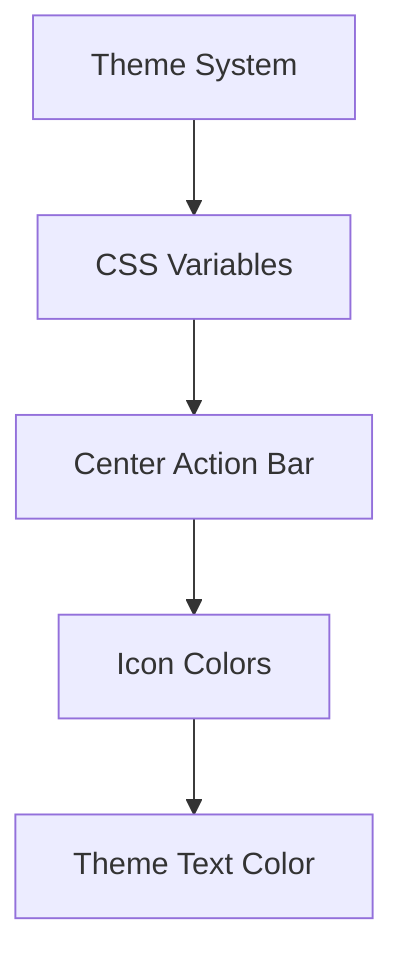
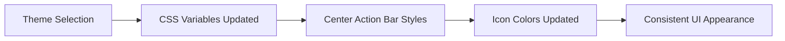

> See also: `docs/architecture-modernization.md` for the proposed React + TypeScript migration plan.

## Architecture Diagram (Conceptual)

## System Workflow (Solution Overview)

## Center Action Bar Icon Colors Fix

### Overview
The center action bar icons now use the theme's text color variable (`--color-text`) instead of a hardcoded white color, ensuring proper theme integration and visual consistency.

### Technical Details
- **Before**: Icons used `--centerbar-icon-color: #ffffff` (hardcoded)
- **After**: Icons use `--color-text` (theme-dependent)
- **Files Modified**: `styles/center-action-bar.css`
- **Impact**: Improved theme consistency and maintainability

### Integration Points
- Theme system (`styles/theme-system.css`)
- Center action bar styling (`styles/center-action-bar.css`)
