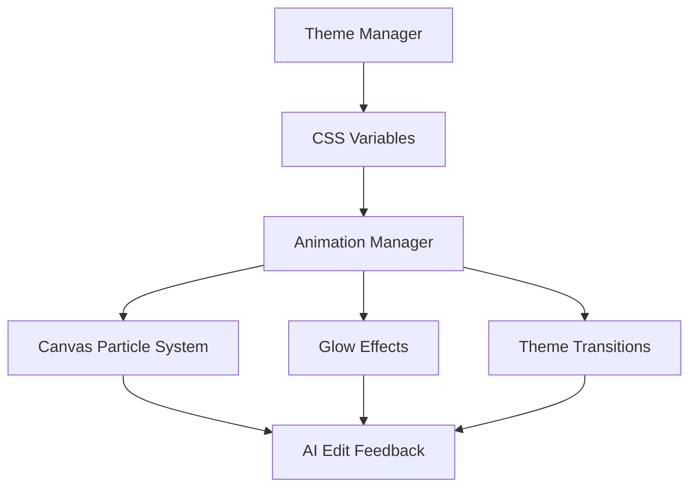

# Theme-Adaptive Visual Feedback System

## Overview

The Theme-Adaptive Visual Feedback System provides sophisticated, theme-aware visual effects for AI edits across all color palettes while maintaining a premium, divine aesthetic. This system dynamically adapts particle effects, glow animations, and visual feedback to complement each theme's unique color palette and characteristics.

## System Architecture



## Theme Analysis

### Theme Classification

Themes are classified by two key characteristics:

1. **Brightness**: Light vs Dark themes
2. **Temperature**: Warm vs Cool themes

### Theme Categories

#### Light Themes
- **Ivory**: Minimalist, neutral palette
- **Champagne**: Warm golden tones
- **Sakura**: Soft pink accents
- **Pearl**: Elegant gold and purple
- **Mint**: Fresh green tones
- **Coral**: Warm coral colors
- **Frost**: Cool blue tones
- **Lavender**: Soft purple palette

#### Dark Themes
- **Midnight**: Deep blue with red accents
- **Graphite**: Neutral gray tones
- **Aurora**: Green cyberpunk aesthetic
- **Emerald**: Rich green palette
- **Arctic Sky**: Cool blue tones
- **Amethyst**: Purple mystical theme
- **Burgundy**: Deep red wine tones

## Glow System Specifications

### CSS Variables

The system uses the following CSS variables defined in `:root`:

```css
:root {
    /* Primary theme colors */
    --primary-color: [theme-primary];
    --secondary-color: [theme-secondary];
    --accent-color: [theme-accent];
    --color-text: [theme-text];
    
    /* Glow system variables */
    --glow-color: [theme-glow];
    --glow-primary: [theme-glow-primary];
    --glow-secondary: [theme-glow-secondary];
    --shadow-color: [theme-shadow];
    --color-glass: [theme-glass];
    --color-border: [theme-border];
    
    /* Animation variables */
    --animation-duration: [theme-duration];
    --animation-easing: [theme-easing];
    
    /* Particle system variables */
    --particle-color: [theme-particle-color];
    --particle-count: [theme-particle-count];
    --particle-size: [theme-particle-size];
}
```

### Glow Color Mappings

#### Light Themes
- **Golden-Ambre Gradient**: Warm golden tones with amber highlights
- **Soft Glow**: Subtle, elegant glow effects
- **Particle Colors**: Complementary warm tones

#### Dark Themes
- **Iridescent White-Gold**: Ethereal white-gold glow with iridescent effects
- **Enhanced Contrast**: Higher contrast glow for visibility
- **Particle Colors**: Bright, luminous particles for contrast

#### Special Themes
- **Arctic Sky**: Electric blue with silver particles
- **Aurora**: Green with cyan highlights
- **Emerald**: Emerald green with gold accents

## Particle System Requirements

### Canvas-Based Particles

The particle system uses HTML5 Canvas for optimal performance:

```javascript
class Particle {
    constructor(x, y, theme, type) {
        this.x = x;
        this.y = y;
        this.theme = theme;
        this.type = type;
        this.divineMotion = this.createDivineMotionPath();
        // ... additional properties
    }
}
```

### Theme-Specific Parameters

#### Particle Count
- **Light Themes**: 30-50 particles (subtle effects)
- **Dark Themes**: 50-80 particles (enhanced visibility)
- **Special Themes**: 40-60 particles (balanced)

#### Particle Size
- **Light Themes**: 2-4px (subtle)
- **Dark Themes**: 3-6px (more visible)
- **Special Themes**: 2-5px (varied)

#### Motion Patterns
- **Divine Motion**: Organic, flowing movements
- **Orbital Motion**: Circular patterns for loading states
- **Sacred Geometry**: Geometric patterns for special effects

### Divine Feeling Motion Paths

Particles follow divine motion paths that create a premium, ethereal feeling:

```javascript
createDivineMotionPath() {
    return {
        phase: Math.random() * Math.PI * 2,
        amplitude: 20 + Math.random() * 30,
        frequency: 0.01 + Math.random() * 0.02,
        verticalDrift: (Math.random() - 0.5) * 0.5
    };
}
```

## Implementation Details

### 1. Theme Extensions

Extended theme definitions in `js/themes.js`:

```javascript
themes: {
    midnight: {
        // ... existing properties
        glowPrimary: '#ff6b6b',
        glowSecondary: '#ffd93d',
        particleColor: '#ffffff',
        particleCount: 60,
        particleSize: 4,
        animationDuration: '2.5s',
        animationEasing: 'cubic-bezier(0.4, 0, 0.2, 1)'
    }
}
```

### 2. CSS Animations

Theme-adaptive animations in `styles/interactions.css`:

```css
.ai-edit-glow {
    animation: aiEditGlow var(--animation-duration) var(--animation-easing);
}

@keyframes aiEditGlow {
    0% {
        box-shadow: 0 0 0 0 var(--glow-primary);
    }
    50% {
        box-shadow: 0 0 20px 10px var(--glow-secondary);
    }
    100% {
        box-shadow: 0 0 0 0 var(--glow-primary);
    }
}
```

### 3. Animation Manager

Enhanced animation system in `js/animations.js`:

```javascript
class AnimationManager {
    createAIEditFeedback(element, type) {
        // Get current theme properties
        const theme = themeManager.getCurrentTheme();
        
        // Create theme-adaptive particle effect
        this.createThemeAdaptiveParticles(x, y, theme, type);
        
        // Add glow effect to element
        this.addAIGlowEffect(element, type);
    }
}
```

## Usage Examples

### AI Edit Feedback

```javascript
// Trigger AI edit feedback
bus.dispatchEvent(new CustomEvent('aiEditStart', {
    detail: { element: taskElement }
}));

// Success feedback
bus.dispatchEvent(new CustomEvent('aiEditSuccess', {
    detail: { element: taskElement }
}));

// Loading state
bus.dispatchEvent(new CustomEvent('aiEditLoading', {
    detail: { element: taskElement }
}));
```

### Divine Blessing Effects

```javascript
// Create special divine blessing
animationManager.createDivineBlessing(element);
```

### Theme Transitions

```javascript
// Smooth theme transitions
bus.dispatchEvent(new CustomEvent('themeChanged', {
    detail: { theme: newThemeName, colors: themeData }
}));
```

## Testing Procedures

### Automated Testing

Use the test file `test/theme-feedback-system-test.html` to verify:

1. **Theme Switching**: Test all 15 themes
2. **Particle Effects**: Verify particles adapt to theme colors
3. **Glow Animations**: Test glow effects per theme
4. **Performance**: Ensure smooth animations across devices

### Manual Testing Checklist

- [ ] All themes load correctly
- [ ] Particle colors match theme palette
- [ ] Glow effects are visible in all themes
- [ ] Animation timing feels appropriate per theme
- [ ] Theme transitions are smooth
- [ ] Performance is acceptable on target devices

### Theme-Specific Tests

#### Light Themes
- Verify glow is subtle but visible
- Check particle count is appropriate for visibility
- Ensure colors don't overwhelm the interface

#### Dark Themes
- Verify glow provides adequate contrast
- Check particle brightness for visibility
- Ensure effects don't cause eye strain

#### Special Themes
- Verify theme-specific effects work correctly
- Check color harmony with existing palette
- Ensure effects enhance the theme's character

## Nebula Pulse Test Checklist

### Theme Compatibility
- [ ] Arctic Sky
- [ ] Midnight Dream
- [ ] Solar Flare
- [ ] Forest Whisper
- [ ] Ocean Depth

### Device Testing
- [ ] Desktop Chrome
- [ ] Desktop Firefox
- [ ] Desktop Safari
- [ ] iOS Safari
- [ ] Android Chrome
- [ ] Tablet devices

### Verification Points
- Animation triggers correctly
- No residual classes after animation
- Mobile duration is shorter (0.6s)
- Fallback works in older browsers
- No performance issues

## Color Mappings

### Detailed Theme Color Analysis

| Theme | Primary | Secondary | Accent | Glow | Glow Primary | Glow Secondary | Particle Color | Count | Size |
|-------|---------|-----------|---------|------|--------------|----------------|----------------|-------|------|
| **Midnight** | #1a1a2e | #16213e | #0f3460 | #e94560 | #ff6b6b | #ffd93d | #ffffff | 60 | 4 |
| **Ivory** | #f8f9fa | #e9ecef | #dee2e6 | #6c757d | #ffd700 | #ff8c00 | #8b4513 | 35 | 2 |
| **Champagne** | #fff8e7 | #f3e5ab | #daa520 | #daa520 | #ffd700 | #ff8c00 | #8b4513 | 40 | 3 |
| **Graphite** | #2c2c2c | #404040 | #666666 | #999999 | #c0c0c0 | #ffffff | #cccccc | 50 | 3 |
| **Aurora** | #0a0a0a | #1a1a2e | #16213e | #00ff88 | #00ff88 | #ffffff | #00ff88 | 70 | 5 |
| **Arctic Sky** | #e6f2ff | #cce5ff | #4da6ff | #4da6ff | #87ceeb | #ffffff | #4da6ff | 45 | 3 |
| **Emerald** | #0c4a3e | #134e4a | #2ecc71 | #2ecc71 | #2ecc71 | #ffd700 | #e8f8f5 | 55 | 4 |
| **Sakura** | #fff5f5 | #ffe0e0 | #ffb3ba | #ff69b4 | #ff69b4 | #ffd700 | #8b2635 | 40 | 3 |
| **Pearl** | #f8f8ff | #e6e6fa | #d4af37 | #d4af37 | #ffd700 | #ffffff | #4b0082 | 35 | 2 |
| **Mint** | #f0fff0 | #e0ffe0 | #2dd4bf | #2dd4bf | #2dd4bf | #ffffff | #006400 | 30 | 2 |
| **Coral** | #fff0f5 | #ffe4e1 | #ff7f50 | #ff7f50 | #ff7f50 | #ffd700 | #8b0000 | 45 | 3 |
| **Frost** | #f0f8ff | #e6f2ff | #22d3ee | #22d3ee | #87ceeb | #ffffff | #000080 | 40 | 3 |
| **Lavender** | #f5f3ff | #e9d5ff | #a78bfa | #a78bfa | #dda0dd | #ffffff | #4b0082 | 50 | 3 |
| **Amethyst** | #4b0082 | #483d8b | #9b59b6 | #9b59b6 | #dda0dd | #ffffff | #dda0dd | 60 | 4 |
| **Burgundy** | #800020 | #800000 | #dc143c | #dc143c | #dc143c | #ffd700 | #f8f8ff | 65 | 4 |

### Animation Parameters

| Theme | Duration | Easing Function | Special Effects |
|-------|----------|----------------|-----------------|
| **Midnight** | 2.5s | cubic-bezier(0.4, 0, 0.2, 1) | Red glow emphasis |
| **Ivory** | 2.0s | cubic-bezier(0.34, 1.56, 0.64, 1) | Quick, elegant |
| **Champagne** | 2.2s | cubic-bezier(0.25, 0.46, 0.45, 0.94) | Warm golden flow |
| **Graphite** | 2.3s | cubic-bezier(0.22, 0.61, 0.36, 1) | Smooth transitions |
| **Aurora** | 2.4s | cubic-bezier(0.4, 0, 0.2, 1) | Ethereal green flow |
| **Arctic Sky** | 2.1s | cubic-bezier(0.34, 1.56, 0.64, 1) | Cool blue energy |
| **Emerald** | 2.6s | cubic-bezier(0.4, 0, 0.2, 1) | Natural flow |
| **Sakura** | 2.2s | cubic-bezier(0.25, 0.46, 0.45, 0.94) | Gentle pink flow |
| **Pearl** | 2.0s | cubic-bezier(0.34, 1.56, 0.64, 1) | Elegant refinement |
| **Mint** | 1.9s | cubic-bezier(0.22, 0.61, 0.36, 1) | Fresh, quick |
| **Coral** | 2.3s | cubic-bezier(0.4, 0, 0.2, 1) | Warm energy |
| **Frost** | 2.1s | cubic-bezier(0.34, 1.56, 0.64, 1) | Cool crystalline |
| **Lavender** | 2.4s | cubic-bezier(0.4, 0, 0.2, 1) | Soft purple flow |
| **Amethyst** | 2.5s | cubic-bezier(0.4, 0, 0.2, 1) | Mystical purple |
| **Burgundy** | 2.7s | cubic-bezier(0.4, 0, 0.2, 1) | Rich, deep flow |

## Performance Considerations

### Optimization Strategies

1. **Canvas Optimization**: Use `requestAnimationFrame` for smooth animations
2. **Particle Limits**: Adjust particle count based on device capabilities
3. **Lazy Loading**: Initialize particle systems only when needed
4. **Memory Management**: Clean up particles after animation completion

### Device Compatibility

- **Mobile**: Reduced particle count (30-40)
- **Tablet**: Standard particle count (40-60)
- **Desktop**: Full particle count (50-80)

## Browser Support

- **Chrome**: Full support
- **Firefox**: Full support
- **Safari**: Full support
- **Edge**: Full support

## Future Enhancements

### Planned Features

1. **Advanced Particle Physics**: More realistic motion simulation
2. **3D Particle Effects**: WebGL integration for enhanced visuals
3. **Custom Theme Support**: User-defined particle effects
4. **Performance Analytics**: Real-time performance monitoring

### Integration Opportunities

1. **Music Visualization**: Sync particles with audio
2. **Weather Effects**: Theme-appropriate weather animations
3. **Time-Based Effects**: Day/night cycle variations
4. **User Preferences**: Customizable effect intensity

## Troubleshooting

### Common Issues

1. **Particles Not Visible**: Check theme color contrast
2. **Performance Issues**: Reduce particle count
3. **Animation Lag**: Optimize canvas rendering
4. **Theme Switching Issues**: Verify CSS variable updates

### Debug Mode

Enable debug mode for troubleshooting:

```javascript
if (window.DEV) {
    window.animationManager = animationManager;
    window.themeManager = themeManager;
}
```

## Conclusion

The Theme-Adaptive Visual Feedback System provides a sophisticated, premium experience that adapts to all available themes while maintaining consistent visual quality. The system combines advanced particle physics, theme-aware color mapping, and smooth animations to create divine feeling visual feedback that enhances the user experience across all color palettes.

---

*Last Updated: 2025-08-07*
*Version: 1.0.0*